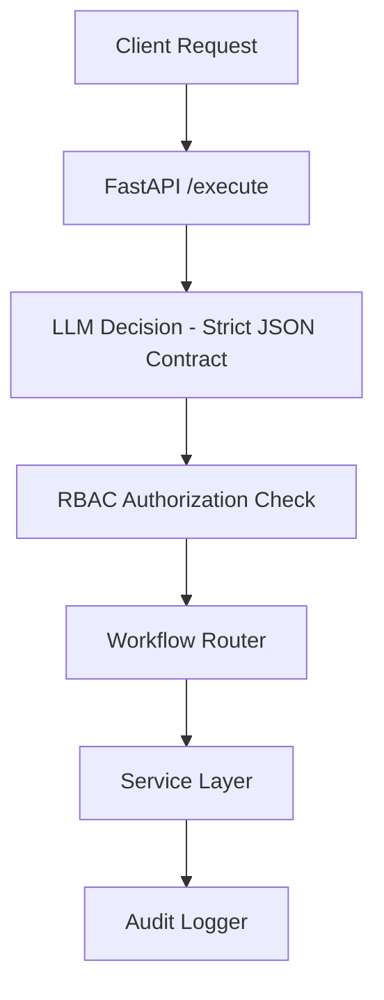

# Enterprise AI Orchestrator

Deterministic AI workflow orchestration layer designed to demonstrate enterprise governance patterns for LLM-driven systems.
  
This project is a structured orchestration engine that converts natural language requests into validated, role gated, auditable workflow executions.

---

## Why This Project Exists

Most AI applications:

- Rely on loosely structured prompts
- Guess missing inputs
- Lack explicit workflow contracts
- Execute without role enforcement
- Provide little or no audit traceability

Enterprise environments require the opposite:

- Explicit workflow selection
- Structured response contracts
- No-guess parameter policy
- Role-based authorization before execution
- Deterministic routing
- Audit logging with traceability

This project demonstrates those patterns.

## Core Capabilities

### 1. Strict Decision Contract

The LLM must return structured JSON that matches a defined contract before any execution occurs.

#### Decision Contract (Enforced Response Schema)

```json
{
  "schema_version": "1.0",
  "workflow": "<allowed_workflow>",
  "parameters": { ... },
  "confidence": 0.0-1.0,
  "rationale": "<one sentence>",
  "missing_fields": []
}
```

#### Enforcement model:

- Exactly one workflow must be selected.
- Required parameters must be present.
- Missing required parameters trigger `needs_clarification`.
- Unsupported requests trigger `unsupported`.
- Invalid or non-JSON responses are rejected and logged.

This ensures deterministic routing prior to execution.

### 2. Clarification Mode (No-Guess Policy)

If required fields are missing:

```json
{
  "workflow": "needs_clarification",
  "missing_fields": ["client_id", "risk_domain"]
}
```

The system does not invent or default missing parameters.

### 3. RBAC Enforcement Model

User identity is provided via `x-user` request header.

- Users are mapped to roles.
- Role-to-workflow authorization is checked before routing execution.
- Unauthorized workflow attempts are rejected and logged.
- Current implementation uses a static role map for demonstration purposes.

This layer is intentionally structured to support replacement with:

- OAuth / OIDC
- SAML
- External identity providers

### 4. Deterministic Routing Layer

Execution flow:


#### Supported workflows:

- `generate_risk_report`
- `generate_financial_report`
- `sync_client`
- `needs_clarification`
- `unsupported`

Routing is explicit and does not depend on ambiguous intent matching.

### 5. Audit Logging

Execution logs are persisted to SQLite for local auditability.

Stored fields include:

- `trace_id`
- `user_id`
- `role`
- `request_message`
- `workflow`
- `confidence`
- `decision_json`
- `result_json`
- `timestamp`

Example query:

```python
import sqlite3

c = sqlite3.connect("data/logs.sqlite")
cur = c.cursor()

print(cur.execute("""
SELECT trace_id, workflow, confidence, created_at
FROM logs
ORDER BY id DESC
LIMIT 5
""").fetchall())

c.close()
```

SQLite is used for portability and simplicity in this capstone.
The logging layer is intentionally designed to be migrated to PostgreSQL or an external SIEM system.

### 6. Health and Evaluation Endpoints

`GET /health`

Verifies:

- API availability
- Database connectivity

Example response:

```json
{
  "status": "ok",
  "db_ok": true
}
```

`GET /eval`

Runs deterministic tests against the decision layer.

Validates:

- Clarification behavior
- Unsupported request handling
- Workflow selection correctness

Example response:

```json
{
  "passed": 3,
  "total": 3,
  "results": [...]
}
```

This provides a lightweight evaluation harness for regression detection.

## **Example Execution**

### **Request**

```json
{
  "message": "Generate a cyber risk report for client 123 as of 2026-02-18"
}
```

Header:
```code
x-user: finance_user
```
### **Response**

```json
{
  "trace_id": "...",
  "workflow": "generate_risk_report",
  "result": {
    "report": "Risk report generated for client_id=123, domain=cyber, as_of_date=2026-02-18",
    "status": "success",
    "inputs": {
      "client_id": 123,
      "risk_domain": "cyber",
      "as_of_date": "2026-02-18"
    }
  }
}
```
## Failure Handling Model

The system is designed to fail safely.

- Invalid JSON from LLM → request rejected and logged.
- Missing required fields → clarification mode.
- Unauthorized workflow → access denied.
- Service layer exception → logged with `trace_id`.
- Evaluation suite detects regression in decision behavior.

This prevents silent execution failures.

## Failure Handling Model

The system is designed to fail safely.

- Invalid JSON from LLM → request rejected and logged.
- Missing required fields → clarification mode.
- Unauthorized workflow → access denied.
- Service layer exception → logged with `trace_id`.
- Evaluation suite detects regression in decision behavior.

This prevents silent execution failures.

## Roadmap

- PostgreSQL migration via SQLAlchemy
- External identity provider integration
- Confidence threshold gating
- Structured schema validation layer
- SIEM compatible logging export

## Author Positioning

Built by an AI Automation & Cloud Systems Architect specializing in:

- Financial intelligence systems
- Secure AI workflow orchestration
- Agentic enterprise enablement
- Governance-first LLM integration
- Observability-driven system design

## Summary

This project focuses on governance, determinism, and auditability.

It demonstrates how AI systems can be integrated into structured, role-gated enterprise environments without sacrificing control.
