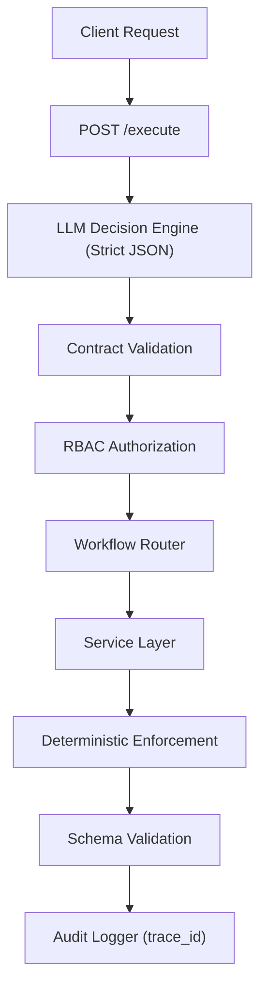

---

# Enterprise AI Orchestrator

Governance-First Deterministic Control Plane for LLM-Driven Enterprise Systems

Enterprise AI Orchestrator is a structured orchestration engine that converts natural language requests into validated, role-gated, auditable workflow executions under deterministic control boundaries.

---

# Executive Summary

Enterprise AI systems fail when they rely on:

* Implicit intent inference
* Loose prompt structures
* Missing parameter guessing
* Uncontrolled execution paths
* No audit traceability

Enterprise environments require:

* Explicit workflow contracts
* Deterministic routing
* Role-based authorization
* Schema-validated execution
* Regression-gated behavior
* Fail-closed enforcement

**Enterprise AI Orchestrator** demonstrates how LLMs can operate inside a governance-first execution framework without sacrificing control.

---

# Architectural Philosophy

The system separates responsibility between two planes:

## Control Plane

* LLM decision engine
* Strict JSON contract enforcement
* Workflow selection
* Clarification logic
* Unsupported intent handling

## Execution Plane

* Service-level parameter validation
* Deterministic risk scoring enforcement
* Escalation threshold logic
* Schema validation (Pydantic)
* Structured output guarantees

LLMs propose.
Code enforces.

---

# High-Level Execution Flow



Execution requires:

1. Valid contract
2. Role authorization
3. Schema compliance
4. Deterministic enforcement

---

# Strict Decision Contract

The LLM must return exactly:

```json
{
  "schema_version": "1.0",
  "workflow": "<allowed_workflow>",
  "parameters": { ... },
  "confidence": 0.0-1.0,
  "rationale": "<one sentence>",
  "missing_fields": []
}
```

Enforcement rules:

* Exactly one workflow must be selected
* No invented parameters
* Missing required parameters → `needs_clarification`
* Unsupported intent → `unsupported`
* Invalid JSON → rejected
* Schema version mismatch → rejected
* Confidence clamped to 0–1
* Parameters must be an object

Routing is deterministic and protected before execution.

---

# Supported Production Workflows

## 1. Compliance Policy Review

**Purpose:**
Analyze policy text for compliance risk.

**Deterministic controls:**

* Risk score clamped 0–100
* Risk level derived from score
* Escalation derived from tolerance threshold
* Violations must include quoted evidence from document text
* Minimum document length enforced
* Maximum document length bounded

Escalation is enforced in code.

Schema validated.
Fail-closed on violation.

---

## 2. Vendor Risk Intake (Production v2)

**Purpose:**
Assess third-party vendor risk.

**Controls:**

* Evidence-anchored required controls and due diligence questions
* Risk score clamped and normalized
* Risk level derived deterministically
* Escalation derived from sensitivity (criticality + access level)
* “Insufficient information” floor band (20–40)
* Minimum description length enforced
* Schema validation (fail closed)
* Evidence anchoring required in outputs

Invalid vendor references are filtered in code.

---

## 3. Financial Anomaly Summary

**Purpose:**
Analyze transaction lists for anomaly signals.

**Enterprise safeguards:**

* Transactions sanitized and bounded
* ID whitelisting for flagged results
* Evidence-anchored flagged transactions (quoted id + observed field)
* Deterministic insufficiency handling (<N txns, missing timestamps)
* Score downgrade if high anomaly without anchored evidence
* Escalation derived from tolerance threshold
* Schema validation (fail closed)

Flagged results must reference valid transaction IDs.

---

# RBAC Enforcement

Role → Workflow allowlist mapping:

* finance_analyst
* ops_manager
* compliance_officer
* admin

Workflow execution is blocked before dispatch if not authorized.

Unauthorized attempts return structured error:

```json
{
  "error": "Forbidden workflow for role",
  "workflow": "...",
  "role": "...",
  "allowed_workflows": [...]
}
```

Designed for upgrade to:

* OAuth / OIDC
* SAML
* External IdP
* Zero-trust service mesh

---

# Evaluation & Regression Gates

Two independent test surfaces:

## Control Plane Tests (`/eval`)

Validates:

* Clarification behavior
* Unsupported handling
* Workflow selection
* Contract stability

## Execution Plane Tests (`/eval/workflows`)

Validates:

* Schema enforcement
* Deterministic risk mapping
* Escalation logic
* Evidence anchoring invariants
* Missing parameter rejection
* Insufficient input handling

All workflows are regression-gated before being considered stable.

This prevents silent behavior drift.

---

# Deterministic Enforcement Model

Across all risk workflows:

| Score Range | Level  |
| ----------- | ------ |
| 0–29        | low    |
| 30–69       | medium |
| 70–100      | high   |

Escalation thresholds:

| Tolerance | Escalate At |
| --------- | ----------- |
| low       | ≥ 30        |
| medium    | ≥ 60        |
| high      | ≥ 80        |

LLM proposes score.
Code enforces level and escalation.

---

# Audit Logging

All executions include:

* trace_id
* user_id
* role
* workflow
* confidence
* decision_json
* result_json
* timestamp

Persisted to SQLite for portability.

Designed for migration to:

* PostgreSQL
* Cloud-native database
* SIEM export
* External observability pipelines

Every request is traceable.

---

# Failure Handling Model

Fail-closed design:

* Invalid JSON → rejected
* Schema validation failure → rejected
* Missing parameters → clarification mode
* Unauthorized workflow → rejected
* Hallucinated IDs → filtered
* Insufficient input → deterministic fallback band
* Exceptions logged with trace_id

No silent execution paths.

---

# Production Discipline

Deliberate exclusions (v1 discipline):

* No vector database
* No RAG layer
* No auto-scaling infrastructure
* No uncontrolled workflow expansion
* No removal of evaluation gates

The objective is architectural maturity and deterministic control.

---

# Roadmap (Post v1)

* PostgreSQL migration via SQLAlchemy
* External identity provider integration
* Confidence threshold gating
* Structured evidence objects (v2)
* SIEM-compatible logging export
* Deployment hardening

---

# Author Positioning

Built by an AI Automation & Cloud Systems Architect focused on:

* Financial intelligence systems
* Deterministic LLM governance
* Secure AI orchestration layers
* Enterprise risk workflows
* Observability-driven system design

---

# Summary

Enterprise AI Orchestrator demonstrates that:

LLMs can operate inside controlled, auditable, deterministic enterprise systems.

This project prioritizes:

* Governance
* Determinism
* Evidence anchoring
* Fail-closed enforcement
* Regression protection
* Role-based execution boundaries

Enterprise AI requires control before scale.

This system implements that principle.

---
